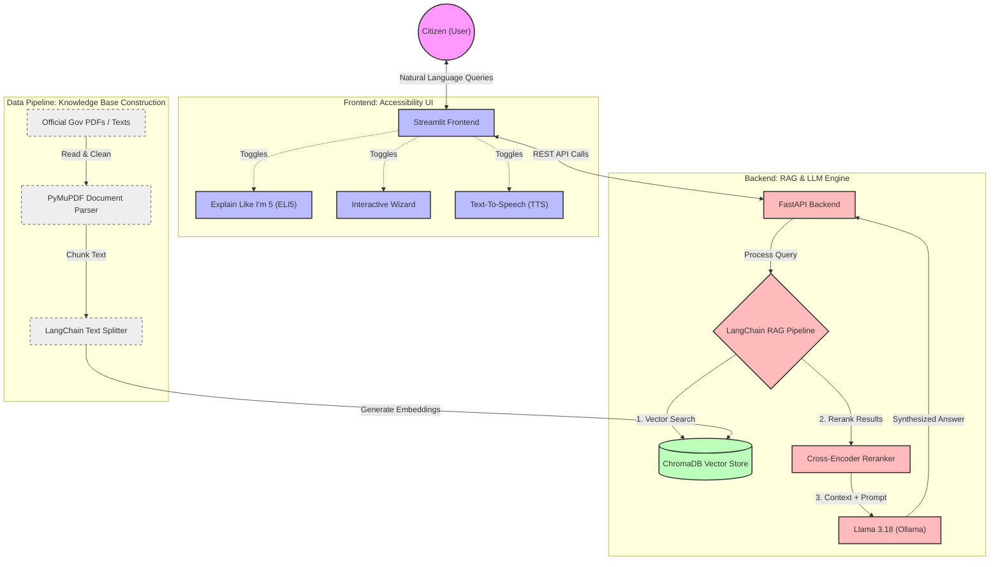

# AccessGov Architecture Flow

```mermaid
flowchart TD
    %% Define Styles
    classDef user fill:#f9f,stroke:#333,stroke-width:2px;
    classDef frontend fill:#bbf,stroke:#333,stroke-width:2px;
    classDef backend fill:#fbb,stroke:#333,stroke-width:2px;
    classDef database fill:#bfb,stroke:#333,stroke-width:2px;
    classDef data fill:#eee,stroke:#333,stroke-width:1px,stroke-dasharray: 5 5;

    %% User Interaction
    U(("Citizen (User)")):::user <-->|Natural Language Queries| S["Streamlit Frontend"]:::frontend
    
    %% Frontend Features
    subgraph "Frontend: Accessibility UI"
        S -.->|Toggles| S1["Explain Like I'm 5 (ELI5)"]:::frontend
        S -.->|Toggles| S2["Interactive Wizard"]:::frontend
        S -.->|Toggles| S3["Text-To-Speech (TTS)"]:::frontend
    end

    %% Backend & RAG
    S <-->|REST API Calls| F["FastAPI Backend"]:::backend
    
    subgraph "Backend: RAG & LLM Engine"
        F -->|Process Query| RAG{"LangChain RAG Pipeline"}:::backend
        RAG -->|1. Vector Search| VDB[("ChromaDB Vector Store")]:::database
        RAG -->|2. Rerank Results| RERANK["Cross-Encoder Reranker"]:::backend
        RERANK -->|3. Context + Prompt| LLM["Llama 3.18 (Ollama)"]:::backend
        LLM -->|Synthesized Answer| F
    end

    %% Data Pipeline
    subgraph "Data Pipeline: Knowledge Base Construction"
        RAW["Official Gov PDFs / Texts"]:::data -->|Read & Clean| PARSER["PyMuPDF Document Parser"]:::data
        PARSER -->|Chunk Text| SPLIT["LangChain Text Splitter"]:::data
        SPLIT -->|Generate Embeddings| VDB
    end
```
